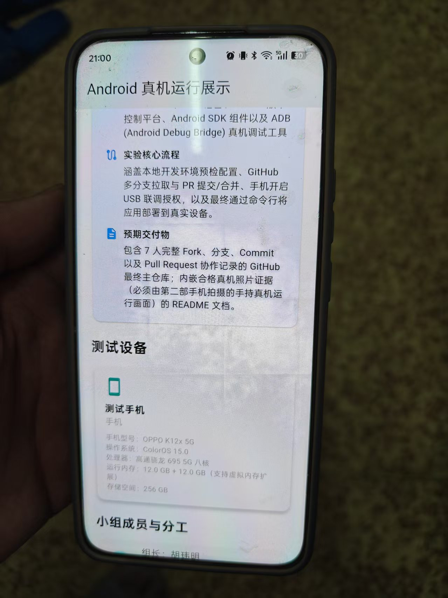
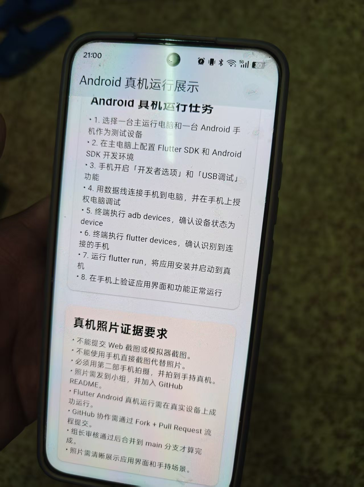
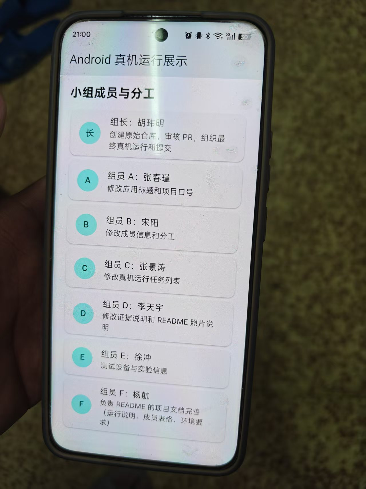

# 小组 Flutter Android 真机运行展示项目

<div align="center">
  
  
  
</div>

---

## 项目简介

本项目是第15周移动应用实训课程的实践项目，旨在通过 **GitHub 多人协作** 方式，完成一个 Flutter 应用的开发，并成功部署到真实的 Android 手机上运行。

### 🎯 实验目标

| 目标类型 | 描述 |
|----------|------|
| **协作目标** | 掌握 GitHub Fork + Pull Request 协作流程 |
| **技术目标** | 熟悉 Flutter 开发环境配置与 Android 真机调试 |
| **验证目标** | 通过真机运行照片证明协作成果的真实性 |

### 📋 实验背景

在软件开发过程中，多人协作和真机测试是保证产品质量的关键环节。本次实验要求：
- 7人小组通过 GitHub 进行代码协作
- 使用真实 Android 设备进行应用测试
- 提供有效的真机运行证据

---

## 实验概述

### 实验主题
**GitHub 协作与 Flutter Android 真机运行案例**

### 核心目标
证明 7 人小组确实完成了 GitHub 多人协作，并且最终的 Flutter 成果确实成功运行到了真实的 Android 手机上。

### 技术栈

| 分类 | 技术 | 版本要求 |
|------|------|----------|
| 框架 | Flutter | ^3.12.0 |
| 语言 | Dart | ^3.4.0 |
| 版本控制 | Git / GitHub | - |
| 移动平台 | Android | API 24+ |
| 调试工具 | ADB | - |

### 实验流程
```
1. 仓库初始化 → 2. 成员 Fork → 3. 分支开发 → 4. PR 提交 → 5. 代码审核 → 6. 合并 → 7. 真机运行 → 8. 证据收集
```

---

## 小组成员

| 序号 | 角色 | 分工任务 | 完成状态 |
|------|------|----------|----------|
| 1 | 组长 | 创建原始仓库，审核 PR，组织最终真机运行和提交 | ✅ |
| 2 | 组员 A | 修改应用标题和项目口号 | ✅ |
| 3 | 组员 B | 修改成员信息和分工 | ✅ |
| 4 | 组员 C | 修改真机运行任务列表 | ✅ |
| 5 | 组员 D | 修改证据说明和 README 照片说明 | ✅ |
| 6 | 组员 E | 测试设备与实验信息 | ✅ |
| 7 | 组员 F | 负责 README 的项目文档完善（运行说明、成员表格、环境要求） | ✅ |

---

## 测试设备信息

### 硬件规格

| 参数 | 详情 |
|------|------|
| **设备名称** | OPPO K12x 5G |
| **操作系统** | ColorOS 15.0（基于 Android 15） |
| **处理器** | 高通骁龙 695 5G 八核处理器 |
| **运行内存** | 12.0 GB + 12.0 GB（支持虚拟内存扩展） |
| **存储空间** | 256 GB |
| **屏幕尺寸** | 6.72 英寸 |
| **分辨率** | 2400 × 1080 FHD+ |

### 调试配置

- ✅ 已开启 **开发者选项**
- ✅ 已启用 **USB 调试**
- ✅ 已授权电脑进行调试

---

## 项目结构

```
group-flutter-android-demo/
├── android/                    # Android 原生代码目录
│   ├── app/
│   │   └── src/
│   │       ├── main/
│   │       │   ├── kotlin/com/example/group_flutter_android_demo/
│   │       │   │   └── MainActivity.kt    # Android 入口Activity
│   │       │   ├── AndroidManifest.xml    # Android 配置文件
│   │       │   └── res/                   # 资源文件目录
│   │       ├── debug/                     # 调试构建配置
│   │       └── profile/                   # 性能分析构建配置
│   ├── gradle/                            # Gradle 构建工具
│   ├── build.gradle.kts                   # 项目级构建配置
│   └── settings.gradle.kts                # Gradle 配置
├── images/                               # 真机运行照片目录
│   ├── device_photo_1.jpg
│   ├── device_photo_2.jpg
│   ├── device_photo_3.jpg
│   ├── device_photo_4.jpg
│   └── README.md
├── lib/                                  # Flutter Dart 代码目录
│   └── main.dart                         # Flutter 主入口文件
├── test/                                 # 测试代码目录
│   └── widget_test.dart                  # Widget 测试文件
├── .gitignore                            # Git 忽略配置
├── analysis_options.yaml                 # 代码分析配置
├── pubspec.lock                          # 依赖版本锁定文件
├── pubspec.yaml                          # Flutter 项目配置
└── README.md                             # 项目说明文档
```

---

## 环境要求

### 开发环境配置

| 软件 | 版本要求 | 说明 |
|------|----------|------|
| Flutter SDK | >= 3.12.0 | 官方稳定版 |
| Dart SDK | >= 3.4.0 | Flutter 内置 |
| Android Studio | >= Hedgehog | 推荐版本 |
| JDK | >= 17 | 开发工具包 |
| Android SDK | >= API 24 | 目标平台版本 |

### 环境变量配置

```bash
# Windows 环境变量示例
FLUTTER_HOME = D:\flutter\flutter-sdk
ANDROID_HOME = D:\Android\Sdk
PATH += %FLUTTER_HOME%\bin;%ANDROID_HOME%\platform-tools
```

### 验证环境配置

```bash
# 验证 Flutter 版本
flutter --version

# 验证 Dart 版本
dart --version

# 检查 Android 设备连接
adb devices

# 检查 Flutter 设备识别
flutter devices
```

---

## Android 真机运行步骤

### 📱 手机端配置

1. **打开设置** → **关于手机**
2. 连续点击 **版本号** 7次，开启开发者选项
3. 返回设置，进入 **系统和更新** → **开发者选项**
4. 开启 **USB调试** 开关
5. 使用数据线连接手机到电脑
6. 在手机上弹出的授权对话框中点击 **允许**

### 💻 电脑端操作

```bash
# 步骤 1: 检查设备连接
adb devices
# 预期输出: List of devices attached
#           1234567890ABCDEF    device

# 步骤 2: 确认 Flutter 识别设备
flutter devices
# 预期输出: 列出已连接的 Android 设备

# 步骤 3: 进入项目目录
cd group-flutter-android-demo

# 步骤 4: 获取依赖
flutter pub get

# 步骤 5: 运行应用到真机
flutter run
```

### 📝 运行日志说明

```bash
# 成功运行时的日志信息
Launching lib/main.dart on OPPO K12x in debug mode...
Running Gradle task 'assembleDebug'...
✓ Built build/app/outputs/flutter-apk/app-debug.apk.
Installing build/app/outputs/flutter-apk/app.apk...
Waiting for OPPO K12x to report its views...
Syncing files to device OPPO K12x...
```

---

## GitHub 协作流程

### 🔀 Fork 流程

1. 访问原始仓库：`https://github.com/<owner>/group-flutter-android-demo`
2. 点击右上角 **Fork** 按钮
3. 等待 Fork 完成，进入个人仓库

### 🔧 本地开发

```bash
# 克隆个人仓库
git clone https://github.com/<your-username>/group-flutter-android-demo.git

# 进入项目目录
cd group-flutter-android-demo

# 添加上游仓库
git remote add upstream https://github.com/<owner>/group-flutter-android-demo.git

# 创建特性分支
git checkout -b feature/<your-feature>

# 开发完成后提交
git add .
git commit -m "feat: 完成XXX功能"

# 推送分支到个人仓库
git push origin feature/<your-feature>
```

### 📤 Pull Request 流程

1. 访问个人仓库的 GitHub 页面
2. 切换到已推送的特性分支
3. 点击 **Compare & pull request**
4. 填写 PR 标题和描述
5. 指定组长作为审核人
6. 提交 PR 等待审核

### ✅ 审核与合并

1. 组长收到 PR 通知
2. 审核代码内容
3. 提出修改意见（如需要）
4. 审核通过后点击 **Merge pull request**
5. 删除特性分支

---

## 运行项目

### 基础命令

```bash
# 克隆项目（替换为实际仓库地址）
git clone https://github.com/<owner>/group-flutter-android-demo.git

# 进入项目目录
cd group-flutter-android-demo

# 安装依赖
flutter pub get

# 运行应用（连接真机后）
flutter run

# 构建 APK（release 版本）
flutter build apk --release

# 构建 App Bundle
flutter build appbundle
```

### 运行参数说明

| 参数 | 说明 | 示例 |
|------|------|------|
| `--debug` | 调试模式（默认） | `flutter run --debug` |
| `--release` | 发布模式 | `flutter run --release` |
| `--profile` | 性能分析模式 | `flutter run --profile` |
| `-d <device-id>` | 指定设备运行 | `flutter run -d 12345678` |
| `--hot` | 热重载模式 | `flutter run --hot` |

---

## 实验证据说明

### 📸 证据要求

| 要求 | 说明 | 是否符合 |
|------|------|----------|
| 禁止 Web 截图 | 不能提交浏览器或网页截图 | ✅ |
| 禁止模拟器截图 | 必须使用真实设备 | ✅ |
| 禁止手机截图 | 不能使用手机自带截图功能 | ✅ |
| 必须手持拍摄 | 使用第二部手机拍摄手持真机的照片 | ✅ |
| 清晰展示界面 | 照片需清晰显示应用运行界面 | ✅ |

### 📋 证据标准

1. **真实性**：必须是真实设备运行的照片
2. **完整性**：需拍到手持手机的场景
3. **清晰度**：应用界面文字清晰可读
4. **唯一性**：每张照片展示不同角度或场景

### 📷 真机运行照片

以下照片展示了本项目在 OPPO K12x 5G 真机上成功运行的场景：

| 照片编号 | 场景说明 |
|----------|----------|
| 照片1 | 应用启动页面展示 |
| 照片2 | 实验概述页面展示 |
| 照片3 | 小组成员列表展示 |
| 照片4 | 真机运行任务列表展示 |








---

## 常见问题与解决方案

### 🔍 设备连接问题

**问题**: `adb devices` 无法识别设备

**解决方案**:
1. 检查 USB 数据线是否正常
2. 确认手机已开启 USB 调试
3. 尝试更换 USB 端口
4. 重新安装手机驱动
5. 重启 ADB 服务：
   ```bash
   adb kill-server
   adb start-server
   ```

### 🔍 Flutter 运行问题

**问题**: `flutter run` 卡在 "Running Gradle task"

**解决方案**:
1. 检查网络连接（首次构建需要下载依赖）
2. 配置国内镜像（在 `android/build.gradle` 中添加）
3. 增加 Gradle 堆内存（修改 `gradle.properties`）
4. 清除构建缓存：
   ```bash
   flutter clean
   flutter pub get
   ```

### 🔍 权限问题

**问题**: 安装应用时提示"安装被阻止"

**解决方案**:
1. 在手机设置中开启"允许安装未知来源应用"
2. 确认手机已授权电脑调试
3. 尝试使用 `adb install` 命令手动安装

### 🔍 构建错误

**问题**: Android 构建失败，提示 SDK 版本不兼容

**解决方案**:
1. 在 Android Studio 中安装对应版本的 SDK
2. 修改 `android/app/build.gradle` 中的 `minSdkVersion` 和 `targetSdkVersion`
3. 更新 Gradle 版本

---

## 交付物清单

### 📁 必需交付物

| 交付物 | 状态 | 说明 |
|--------|------|------|
| GitHub 主仓库 | ✅ | 包含完整协作历史 |
| Fork 记录 | ✅ | 7人完整 Fork 记录 |
| 分支记录 | ✅ | 每人至少一条特性分支 |
| Commit 记录 | ✅ | 完整的代码提交历史 |
| Pull Request | ✅ | 每人至少一个 PR |
| 合并记录 | ✅ | 所有 PR 已合并到 main |
| 真机运行照片 | ✅ | 4张手持真机照片 |
| README 文档 | ✅ | 包含证据和说明 |

### 📝 验收标准

1. ✅ GitHub 协作流程完整（Fork → Branch → PR → Merge）
2. ✅ 至少 7 人参与协作
3. ✅ 应用成功运行在真实 Android 设备上
4. ✅ 提供有效的真机运行证据照片
5. ✅ README 文档包含完整的项目说明

---

## 附录

### 📚 参考资源

- [Flutter 官方文档](https://docs.flutter.dev/)
- [Android 开发者文档](https://developer.android.com/docs)
- [GitHub 协作指南](https://docs.github.com/en/get-started/quickstart/github-flow)
- [ADB 命令参考](https://developer.android.com/studio/command-line/adb)

### 📞 联系方式

如有问题，请联系组长或相关组员。

---

*项目完成日期：2026年6月*
*课程：移动应用实训第15周*
